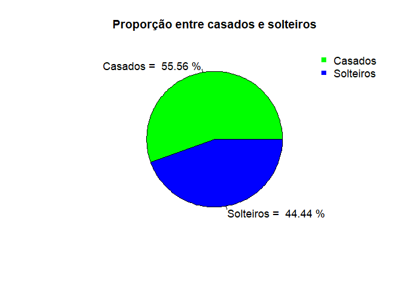
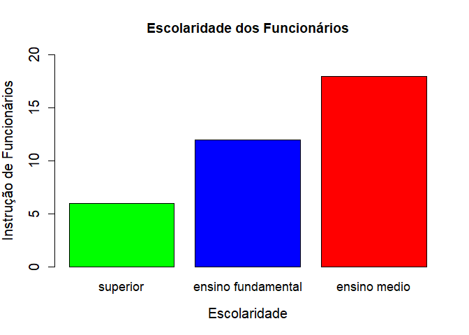
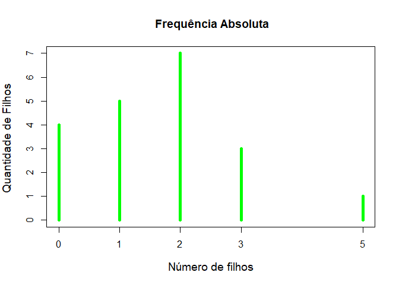
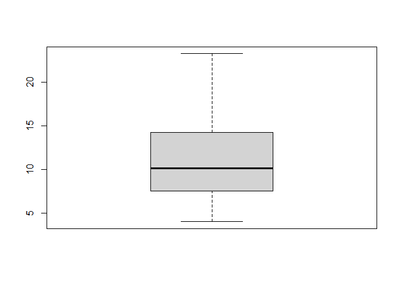
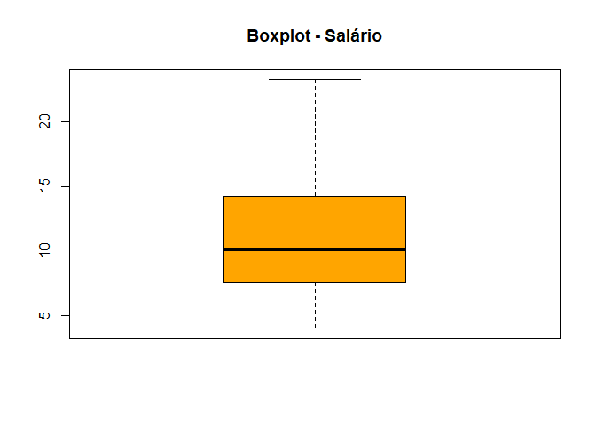
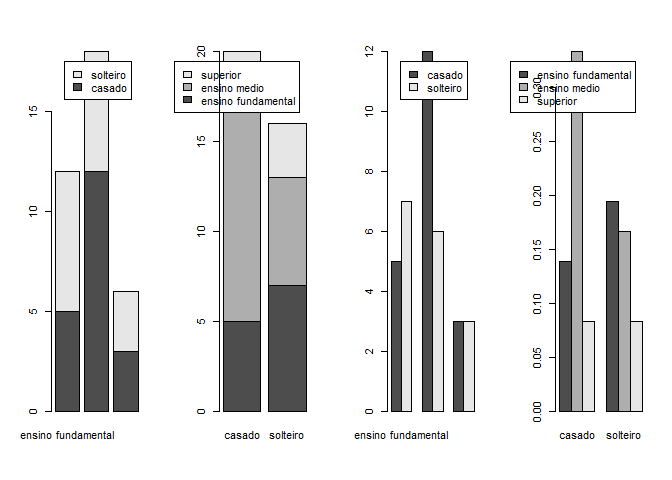
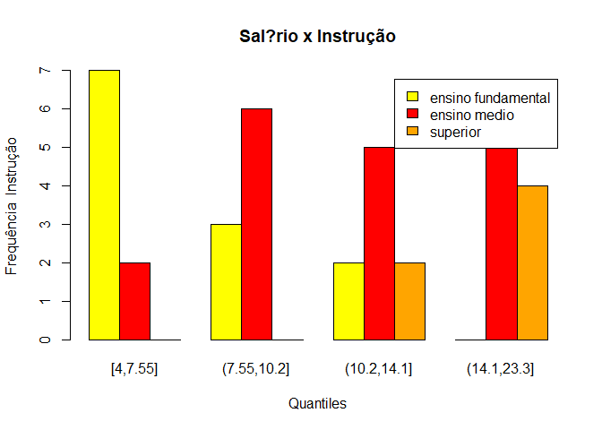
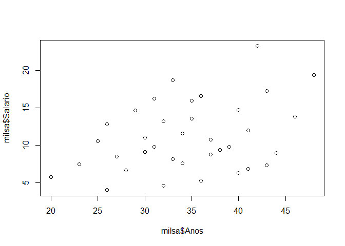
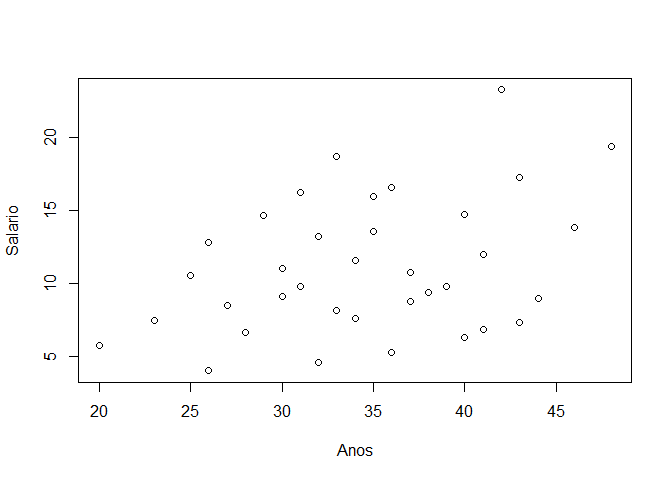

Conceitos Iniciais em R
================

# Iniciando no R

``` r
url <- "../../data/TabelaLivro.csv"
```

A util `read.csv()` importa arquivos em fomato csv. `header` especifica se a
primeira linha do arquivo expressa o nome das variáveis e `sep` é usado
para definir qual caractere separa os valores no dataset. No caso do
dataset milsa, os valores são separados pelo símbolo de ponto e vírgula.

``` r
milsa <- read.csv(url, header = TRUE, sep = ";")
```

Podemos observar um resumo da estrutura de qualquer objeto com a util
`str()`.

``` r
str(milsa)
```

    ## 'data.frame':    36 obs. of  8 variables:
    ##  $ Funcionario: int  1 2 3 4 5 6 7 8 9 10 ...
    ##  $ Est.civil  : chr  "solteiro" "casado" "casado" "solteiro" ...
    ##  $ Instrucao  : chr  "ensino fundamental" "ensino fundamental" "ensino fundamental" "ensino medio" ...
    ##  $ Filhos     : int  NA 1 2 NA NA 0 NA NA 1 NA ...
    ##  $ Salario    : num  4 4.56 5.25 5.73 6.26 6.66 6.86 7.29 7.59 7.44 ...
    ##  $ Anos       : int  26 32 36 20 40 28 41 43 34 23 ...
    ##  $ Meses      : int  3 10 5 10 7 0 0 4 10 6 ...
    ##  $ Regiao     : chr  "interior" "capital" "capital" "outra" ...

Podemos selecionar colunas aplicando `objeto$nome_da_colunas`. Abaixo
selecionamos a coluna `Est.civil` e aplicamos a função `table()` para
construir uma tabela de frequências absolutas com seus valores.

``` r
civil.tb <- table(milsa$Est.civil)
```

# Plotando um gráfico de barras

`col`: vetor com as cores das barras.

`main, xlab, ylab`: título do gŕafico e
os rótulos dos eixos x e y, respectivamente. 

`ylim`: vetor com os limites do eixo y.

`cex.names, cex.axis, cex.labels`: tamanhos do texto nos nomes
das categorias, eixos e rótulos, respectivamente.

`bty`: define se/como
será desenhado contorno do gráfico.

``` r
barplot(civil.tb, cex.names=1.5, col=c("green", 
        "blue"), ylab="Número de Funcionários", 
        xlab="Estado civil", cex.axis=1.25,
        main="Proporção entre casados e solteiros",
        cex.lab=1.25,bty="n", ylim=c(0,25))
```

<!-- -->

# Plotando um gráfico de pizza

A seguir, calculamos a porcentagem, com duas casas decimais, de cada uma
das classes da variável `Est.civil`, usando a função `round()`. A função paste
é usada para concatenar o nome de cada classe com suas respectivas
proporções.

``` r
labs<-paste(c("Casados = ", "Solteiros = "),
       round(civil.tb/length(milsa$Est.civil) * 100, 
       digits=2), "%")


# As strings salvas em labs serão os rótulos do nosso gráfico de pizza

pie(civil.tb,labels=labs,col=c("green", "blue"),
       main="Proporção entre casados e solteiros",
       cex=1.1)


#Plotando legenda no canto superior direito (topright)

legend("topright", pch=15, col=c("green","blue"), 
       legend=c("Casados", "Solteiros"),
       cex=1.1, bty="n")
```

<!-- -->

# Variavel Qualitativa Ordinal

## Frequência absoluta

``` r
inst.tb <- table(milsa$Inst)
inst.tb
```

    ## 
    ## ensino fundamental       ensino medio           superior 
    ##                 12                 18                  6 

## Frequência relativa

``` r
prop.table(inst.tb)
```

    ## 
    ## ensino fundamental       ensino medio           superior 
    ##          0.3333333          0.5000000          0.1666667

## Gráfico de Barras com barras ordenadas

A função `sort()` ordena os dados.

``` r
# Ordem crescente
barplot(sort(inst.tb,decreasing = FALSE),
        cex.names=1.15, 
        col=c("green", "blue", "red"),
        ylab="Instrução de Funcionários", 
        xlab="Escolaridade", cex.axis=1.25,
        main="Escolaridade dos Funcionários",
        cex.lab=1.25,bty="n", ylim=c(0,20))
```

<!-- -->

``` r
# Ordem decrescente
barplot(sort(inst.tb,decreasing = TRUE),
        cex.names=1.15, 
        col=c("green", "blue", "red"),
        ylab="Instrução de Funcionários", 
        xlab="Escolaridade", cex.axis=1.25,
        main="Escolaridade dos Funcionários",
        cex.lab=1.25,bty="n", ylim=c(0,20))
```

<!-- -->

# Trabalhando com variaǘeis quantitativas discretas

``` r
## Frequência absoluta

filhos.tb <- table(milsa$Filhos)

plot(filhos.tb, col =  "green", type = "h",
     lwd = 5, cex.lab=1.2,
     main = " Frequência Absoluta",
     xlab= "Número de filhos",
     ylab= "Quantidade de Filhos ") 
```

<!-- -->

``` r
## Frequência relativa
filhos.tbr <- prop.table(filhos.tb)

## Frequencia relativa acumulada
filhos.tbra <- cumsum(filhos.tbr)

plot(filhos.tbra, type = "S",col = "red",
     main = "Frequência relativa acumulada",
     lwd = 5 )
```

<!-- -->

``` r
## Frequência absoluta e relativa acumulada
filhos.tbra <- cumsum(filhos.tbr)
filhos.tba <- cumsum(filhos.tb)

# A função cbind combina vetores

filhosTabResul = cbind(filhos.tb,filhos.tba,
                 filhos.tbr = round(filhos.tbr*100,digits = 2),
                 filhos.tbra= round(filhos.tbra*100,digits = 2))
filhosTabResul
```

    ##   filhos.tb filhos.tba filhos.tbr filhos.tbra
    ## 0         4          4         20          20
    ## 1         5          9         25          45
    ## 2         7         16         35          80
    ## 3         3         19         15          95
    ## 5         1         20          5         100

# Medidas de posição

## Moda

`Which.max()` retorna o rótulo mais frequente numa variável.

``` r
names(filhos.tb)[which.max(filhos.tb)]
```

    ## [1] "2"

## Mediana

``` r
median(milsa$Filhos, na.rm = TRUE)
```

    ## [1] 2

## Média

``` r
mean(milsa$Filhos, na.rm = TRUE)
```

    ## [1] 1.65

## Quartis

``` r
quantile(milsa$Filhos, na.rm = TRUE)
```

    ##   0%  25%  50%  75% 100% 
    ##    0    1    2    2    5

## Máximo e mínimo

``` r
max(milsa$Filhos, na.rm = TRUE)
```

    ## [1] 5

``` r
min(milsa$Filhos, na.rm = TRUE)
```

    ## [1] 0

As duas infomações juntas:

``` r
range(milsa$Filhos, na.rm = TRUE)
```

    ## [1] 0 5

## Amplitude

É a diferença entre máximo e mínimo.

``` r
diff(range(milsa$Filhos, na.rm = TRUE))
```

    ## [1] 5

## Variância

``` r
var(milsa$Filhos, na.rm = TRUE)
```

    ## [1] 1.607895

## Desvio-padrão

``` r
sd(milsa$Filhos, na.rm = TRUE)
```

    ## [1] 1.268028

## Coeficiente de variação

``` r
sd(milsa$Filhos, na.rm = TRUE)/mean(milsa$Filhos, na.rm = TRUE)
```

    ## [1] 0.7685018

## Quartis

``` r
(filhos.qt <- quantile(milsa$Filhos, na.rm = TRUE))
```

    ##   0%  25%  50%  75% 100% 
    ##    0    1    2    2    5

## Resumo

``` r
summary(milsa$Filhos)
```

    ##    Min. 1st Qu.  Median    Mean 3rd Qu.    Max.    NA's 
    ##    0.00    1.00    2.00    1.65    2.00    5.00      16

# Trabalhando com variáveis quantitativas contínuas

``` r
Salario.tb <- (milsa$Salario)
sort (Salario.tb)
```

    ##  [1]  4.00  4.56  5.25  5.73  6.26  6.66  6.86  7.29  7.44  7.59  8.12  8.46
    ## [13]  8.74  8.95  9.13  9.35  9.77  9.80 10.53 10.76 11.06 11.59 12.00 12.79
    ## [25] 13.23 13.60 13.85 14.69 14.71 15.99 16.22 16.61 17.26 18.75 19.40 23.30

``` r
Amplitude <- max (Salario.tb) - min(Salario.tb) 
NK <-  round( 1 + 3.222 * log10(length(Salario.tb)))
AmpClasse <- Amplitude / NK

limitesclas <- c(4 ,7.25 ,10.50 ,13.75 ,17.00 ,20.25, 23.50)

classes<-c("04.00-07.25","07.25-10.50","10.50-13.75",
           "13.75-17.00","17.00-20.25", "20.25-23.50")

# A função cut divide os valores de um vetor em intervalos delimitados no parâmetro breaks
Freq = table(cut(Salario.tb, breaks = limitesclas, right=FALSE, labels=classes))

FreqAc <- cumsum(Freq)
FreqRel <- prop.table(Freq)
FreqRelAc <- cumsum(FreqRel)

TabResul = cbind(Freq,FreqAc, FreqRel = round(FreqRel*100,digits = 2),
                              FreqRelAc= round(FreqRelAc*100,digits = 2))
TabResul
```

    ##             Freq FreqAc FreqRel FreqRelAc
    ## 04.00-07.25    7      7   19.44     19.44
    ## 07.25-10.50   11     18   30.56     50.00
    ## 10.50-13.75    8     26   22.22     72.22
    ## 13.75-17.00    6     32   16.67     88.89
    ## 17.00-20.25    3     35    8.33     97.22
    ## 20.25-23.50    1     36    2.78    100.00

## Histograma

``` r
h = hist(Salario.tb, breaks=limitesclas,
    ylab="Frequencias absolutas",  xlab="Salário", labels=classes,main="Histograma", 
    xlim=c(4,25), ylim = c (0,12), col="orange")

# Desenhando o polígono de frequências
lines(c(min(h$breaks), h$mids, max(h$breaks)), 
       c(0,h$counts, 0), type = "l")
```

<!-- -->

``` r
## Mediana
median(milsa$Salario)
```

    ## [1] 10.165

``` r
## Média
mean(milsa$Salario)
```

    ## [1] 11.11944

``` r
## Quartis
quantile(milsa$Salario)
```

    ##      0%     25%     50%     75%    100% 
    ##  4.0000  7.5525 10.1650 14.0600 23.3000

``` r
## As duas infomações juntas
range(milsa$Salario)
```

    ## [1]  4.0 23.3

``` r
## Amplitude
diff(range(milsa$Salario))
```

    ## [1] 19.3

``` r
## Variância
var(milsa$Salario)
```

    ## [1] 21.06637

``` r
## Desvio-padrão
sd(milsa$Salario)
```

    ## [1] 4.589812

``` r
## Coeficiente de variação
sd(milsa$Salario)/mean(milsa$Salario)
```

    ## [1] 0.4127735

``` r
## Quartis
(Salario.qt <- quantile(milsa$Salario))
```

    ##      0%     25%     50%     75%    100% 
    ##  4.0000  7.5525 10.1650 14.0600 23.3000

``` r
## Resumo
summary(milsa$Salario)
```

    ##    Min. 1st Qu.  Median    Mean 3rd Qu.    Max. 
    ##   4.000   7.553  10.165  11.119  14.060  23.300

## Box plot

``` r
boxplot(milsa$Salario)
```

<!-- -->

``` r
boxplot(milsa$Salario,  col = "orange", main="Boxplot - Salário")
```

<!-- -->

# Variáveis qualitativa vs qualitativa (Estado Civil vs Instrução)

``` r
civ.ins.tb <- with(milsa, table(Est.civil, Instrucao))

## Comando equivalente
table(milsa$Est.civil, milsa$Instrucao)
```

    ##           
    ##            ensino fundamental ensino medio superior
    ##   casado                    5           12        3
    ##   solteiro                  7            6        3

``` r
## Mudar a ordem de apuração
table( milsa$Instrucao, milsa$Est.civil)
```

    ##                     
    ##                      casado solteiro
    ##   ensino fundamental      5        7
    ##   ensino medio           12        6
    ##   superior                3        3

``` r
## Adicionando os títulos de cada eixo
addmargins(civ.ins.tb)
```

    ##           Instrucao
    ## Est.civil  ensino fundamental ensino medio superior Sum
    ##   casado                    5           12        3  20
    ##   solteiro                  7            6        3  16
    ##   Sum                      12           18        6  36

``` r
## Frequência relativa
prop.table(civ.ins.tb)
```

    ##           Instrucao
    ## Est.civil  ensino fundamental ensino medio   superior
    ##   casado           0.13888889   0.33333333 0.08333333
    ##   solteiro         0.19444444   0.16666667 0.08333333

``` r
## Frequencia Relativa por linha 

prop.table(civ.ins.tb, margin = 1)
```

    ##           Instrucao
    ## Est.civil  ensino fundamental ensino medio superior
    ##   casado               0.2500       0.6000   0.1500
    ##   solteiro             0.4375       0.3750   0.1875

``` r
prop.table(civ.ins.tb, margin = 2)
```

    ##           Instrucao
    ## Est.civil  ensino fundamental ensino medio  superior
    ##   casado            0.4166667    0.6666667 0.5000000
    ##   solteiro          0.5833333    0.3333333 0.5000000

``` r
## Gráficos de Barra

# Usamos a função par para plotar mais de um gráfico de uma vez
par (mfrow = c (1,4))  

barplot(civ.ins.tb, legend= TRUE)
barplot(t(civ.ins.tb), legend= TRUE)

barplot(civ.ins.tb, beside= TRUE, legend= TRUE)
barplot(t(prop.table(civ.ins.tb)), beside= TRUE, legend= TRUE)
```

<!-- -->

# Variáveis qualitativas vs quantitativas (Instrução x Salário)

## Quartis de salário

``` r
quantile(milsa$Salario)
```

    ##      0%     25%     50%     75%    100% 
    ##  4.0000  7.5525 10.1650 14.0600 23.3000

``` r
## Classificação de acordo com os quartis
salario.cut <- cut(milsa$Salario, breaks =  quantile(milsa$Salario),
                   include.lowest = TRUE)

## Tabela de Frequências absolutas
inst.sal.tb <- table(milsa$Inst, salario.cut)
inst.sal.tb
```

    ##                     salario.cut
    ##                      [4,7.55] (7.55,10.2] (10.2,14.1] (14.1,23.3]
    ##   ensino fundamental        7           3           2           0
    ##   ensino medio              2           6           5           5
    ##   superior                  0           0           2           4

## Gráfico de barras

``` r
barplot(inst.sal.tb, 
        col=c("yellow","red",  "orange"), 
        main= "Sal?rio x Instrução",
        xlab = "Quantiles",
        ylab = "Frequência  Instrução",
        beside = TRUE, legend = TRUE)
```

<!-- -->

``` r
## Boxplot
boxplot(Salario ~ Instrucao, data = milsa, col=c("yellow", "red", "orange"))  
```

<!-- -->

# Variáveis quantitativas vs quantitativas (Salario x Idade)

``` r
Anos.cut <- cut(milsa$Anos, breaks = quantile(milsa$Anos),include.lowest = TRUE)

salario.cut <- cut(milsa$Salario, breaks = quantile(milsa$Salario),
                   include.lowest = TRUE)
```

## Tabela cruzada

``` r
Anos.sal.tb <- table(Anos.cut, salario.cut)
Anos.sal.tb
```

    ##            salario.cut
    ## Anos.cut    [4,7.55] (7.55,10.2] (10.2,14.1] (14.1,23.3]
    ##   [20,30]          4           2           3           1
    ##   (30,34.5]        1           3           2           2
    ##   (34.5,40]        2           3           2           3
    ##   (40,48]          2           1           2           3

``` r
plot(x = milsa$Anos, y = milsa$Salario)
```

<!-- -->

``` r
plot(Salario ~ Anos, data = milsa)
```

<!-- -->

# Correlação - verificar associação entre variaveis quantitativas

``` r
cor(milsa$Anos, milsa$Salario)
```

    ## [1] 0.3623982

``` r
cor(milsa$Anos, milsa$Salario, method = "kendall") # Usa coeficiente de Kendall
```

    ## [1] 0.2211641

``` r
cor(milsa$Anos, milsa$Salario, method = "spearman") # Usa coeficiente de Spearman
```

    ## [1] 0.2993303

# Medidas de posição, medidas de dispersão, separatrizes e assimetria

## Médias

``` r
# Média aritmética

valores <- c (10, 15, 20, 25)
mean(valores)
```

    ## [1] 17.5

``` r
# Média poderada

MedPonderada <- function(x,w)
{ sum(x * w) / sum(w)}

# Ler valores e definir pesos
# (Input = 8, 9, 8, 5)

val <- scan()
pesos <- c (1, 2, 3, 4)

MedPonderada(val , pesos)
```

    ## [1] 7

``` r
# Outra maneira de calcular
weighted.mean(val, pesos)
```

    ## [1] 7


``` r
# Funcão para calcular médias aritmetica, geometrica e harmonica

medias3 <- function(x)
{ n <- length(x)
  ma <- mean(x)
  mg <- (prod(x)) ^ (1/n)
  mh <- (1/n * sum(1/x)) ^ (-1)

  cat ( "média aritmética = ", ma,
        "média geométrica = ", mg,
        "média harmônica  = ", mh)
}

# Input 7, 6, 9
x<- scan ()

medias3(x)
```

    ## média aritmética =  7.333333 
    média geométrica =  7.230427
    média harmônica =  7.132075

## Quartis, Quintis, Decis e Percentis

``` r
valores <- c (10, 15, 20, 25)

quantile(valores)
```

    ##    0%   25%   50%   75%  100% 
    ## 10.00 13.75 17.50 21.25 25.00

``` r
quantile(valores, c( 0.10, 0.35, 0.50, 0.75, 0.90))
```

    ##   10%   35%   50%   75%   90% 
    ## 11.50 15.25 17.50 21.25 23.50

## Medidas de dispersão

``` r
xy<-c(16, 38, 18, 20, 20, 18, 22, 34, 7 ,28, 31, 19)

# Amplitude
range(xy)
```

    ## [1]  7 38

``` r
# Intervalo
max(xy) - min(xy)
```

    ## [1] 31

``` r
# Variância
var (xy)
```

    ## [1] 74.81061

``` r
# Desvio padrão
sd (xy)
```

    ## [1] 8.649312

``` r
# Coeficiente de Variação
sd(xy)/mean (xy) * 100
```

    ## [1] 38.29954

``` r
# Médias
medias3(xy)
```

    ## média aritmética =  22.58333 média geométrica =  20.86404 média marmonica  =  18.80128

## Exemplo com dados lidos de um arquivo.csv

``` r
url <- "../../data/IMCvalores.csv"

IMC <- read.csv(url, header = TRUE, sep = ";", dec = ",")

str (IMC)
```

    ## 'data.frame':    30 obs. of  1 variable:
    ##  $ IMCplan: num  15.7 17.7 18.4 18.5 21.3 ...

``` r
boxplot(IMC, col = "red")
```

<!-- -->

``` r
boxplot(IMC, col = "orange", varwidth = TRUE, notch = TRUE)
```

<!-- -->

``` r
mean(IMC$IMCplan)  
```

    ## [1] 25.09811

``` r
median(IMC$IMCplan)
```

    ## [1] 25.0282

``` r
var(IMC$IMCplan)
```

    ## [1] 17.71152

``` r
sd(IMC$IMCplan)
```

    ## [1] 4.208506

``` r
quantile(IMC$IMCplan)
```

    ##       0%      25%      50%      75%     100% 
    ## 15.68070 23.16743 25.02820 28.50798 33.46220

``` r
quantile(IMC$IMCplan, c( 0.10, 0.35, 0.50, 0.75, 0.90))
```

    ##      10%      35%      50%      75%      90% 
    ## 18.49627 23.60246 25.02820 28.50798 29.51026

``` r
medias3(quantile(IMC$IMCplan))
```

    ## média aritmética =  25.1693
    média geométrica =  24.41399
    média marmonica  =  23.60116
