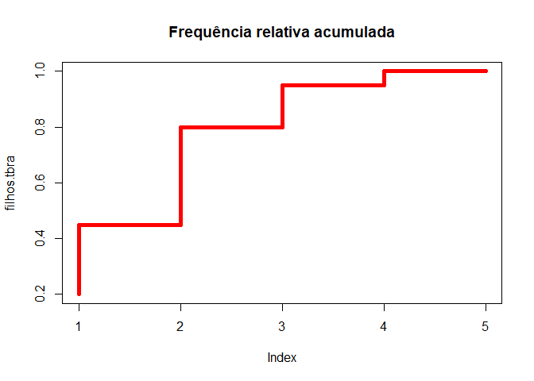

Introdução ao R
================

## Criação de objetos

<<<<<<< HEAD:source/markdown/iniciando-no-r.md
Em R, existem dois comandos de atribuição disponíveis: `<-` e `=`. Desse
modo, escrever:
=======
``` r
url <- "../../data/TabelaLivro.csv"
```

A util `read.csv()` importa arquivos em fomato csv. `header` especifica se a
primeira linha do arquivo expressa o nome das variáveis e `sep` é usado
para definir qual caractere separa os valores no dataset. No caso do
dataset milsa, os valores são separados pelo símbolo de ponto e vírgula.

``` r
milsa <- read.csv(url, header = TRUE, sep = ";")
```

Podemos observar um resumo da estrutura de qualquer objeto com a util
`str()`.

``` r
str(milsa)
```

    ## 'data.frame':    36 obs. of  8 variables:
    ##  $ Funcionario: int  1 2 3 4 5 6 7 8 9 10 ...
    ##  $ Est.civil  : chr  "solteiro" "casado" "casado" "solteiro" ...
    ##  $ Instrucao  : chr  "ensino fundamental" "ensino fundamental" "ensino fundamental" "ensino medio" ...
    ##  $ Filhos     : int  NA 1 2 NA NA 0 NA NA 1 NA ...
    ##  $ Salario    : num  4 4.56 5.25 5.73 6.26 6.66 6.86 7.29 7.59 7.44 ...
    ##  $ Anos       : int  26 32 36 20 40 28 41 43 34 23 ...
    ##  $ Meses      : int  3 10 5 10 7 0 0 4 10 6 ...
    ##  $ Regiao     : chr  "interior" "capital" "capital" "outra" ...

Podemos selecionar colunas aplicando `objeto$nome_da_colunas`. Abaixo
selecionamos a coluna `Est.civil` e aplicamos a função `table()` para
construir uma tabela de frequências absolutas com seus valores.

``` r
civil.tb <- table(milsa$Est.civil)
```

# Plotando um gráfico de barras

`col`: vetor com as cores das barras.

`main, xlab, ylab`: título do gŕafico e
os rótulos dos eixos x e y, respectivamente. 

`ylim`: vetor com os limites do eixo y.

`cex.names, cex.axis, cex.labels`: tamanhos do texto nos nomes
das categorias, eixos e rótulos, respectivamente.

`bty`: define se/como
será desenhado contorno do gráfico.

``` r
barplot(civil.tb, cex.names=1.5, col=c("green", 
        "blue"), ylab="Número de Funcionários", 
        xlab="Estado civil", cex.axis=1.25,
        main="Proporção entre casados e solteiros",
        cex.lab=1.25,bty="n", ylim=c(0,25))
```

<!-- -->

# Plotando um gráfico de pizza

A seguir, calculamos a porcentagem, com duas casas decimais, de cada uma
das classes da variável `Est.civil`, usando a função `round()`. A função paste
é usada para concatenar o nome de cada classe com suas respectivas
proporções.

``` r
labs<-paste(c("Casados = ", "Solteiros = "),
       round(civil.tb/length(milsa$Est.civil) * 100, 
       digits=2), "%")


# As strings salvas em labs serão os rótulos do nosso gráfico de pizza

pie(civil.tb,labels=labs,col=c("green", "blue"),
       main="Proporção entre casados e solteiros",
       cex=1.1)


#Plotando legenda no canto superior direito (topright)

legend("topright", pch=15, col=c("green","blue"), 
       legend=c("Casados", "Solteiros"),
       cex=1.1, bty="n")
```

<!-- -->

# Variavel Qualitativa Ordinal

## Frequência absoluta

``` r
inst.tb <- table(milsa$Inst)
inst.tb
```

    ## 
    ## ensino fundamental       ensino medio           superior 
    ##                 12                 18                  6 

## Frequência relativa

``` r
prop.table(inst.tb)
```

    ## 
    ## ensino fundamental       ensino medio           superior 
    ##          0.3333333          0.5000000          0.1666667

## Gráfico de Barras com barras ordenadas

A função `sort()` ordena os dados.

``` r
# Ordem crescente
barplot(sort(inst.tb,decreasing = FALSE),
        cex.names=1.15, 
        col=c("green", "blue", "red"),
        ylab="Instrução de Funcionários", 
        xlab="Escolaridade", cex.axis=1.25,
        main="Escolaridade dos Funcionários",
        cex.lab=1.25,bty="n", ylim=c(0,20))
```

<!-- -->

``` r
# Ordem decrescente
barplot(sort(inst.tb,decreasing = TRUE),
        cex.names=1.15, 
        col=c("green", "blue", "red"),
        ylab="Instrução de Funcionários", 
        xlab="Escolaridade", cex.axis=1.25,
        main="Escolaridade dos Funcionários",
        cex.lab=1.25,bty="n", ylim=c(0,20))
```

<!-- -->

# Trabalhando com variaǘeis quantitativas discretas

``` r
## Frequência absoluta

filhos.tb <- table(milsa$Filhos)

plot(filhos.tb, col =  "green", type = "h",
     lwd = 5, cex.lab=1.2,
     main = " Frequência Absoluta",
     xlab= "Número de filhos",
     ylab= "Quantidade de Filhos ") 
```

<!-- -->

``` r
## Frequência relativa
filhos.tbr <- prop.table(filhos.tb)

## Frequencia relativa acumulada
filhos.tbra <- cumsum(filhos.tbr)

plot(filhos.tbra, type = "S",col = "red",
     main = "Frequência relativa acumulada",
     lwd = 5 )
```

<!-- -->

``` r
## Frequência absoluta e relativa acumulada
filhos.tbra <- cumsum(filhos.tbr)
filhos.tba <- cumsum(filhos.tb)

# A função cbind combina vetores

filhosTabResul = cbind(filhos.tb,filhos.tba,
                 filhos.tbr = round(filhos.tbr*100,digits = 2),
                 filhos.tbra= round(filhos.tbra*100,digits = 2))
filhosTabResul
```

    ##   filhos.tb filhos.tba filhos.tbr filhos.tbra
    ## 0         4          4         20          20
    ## 1         5          9         25          45
    ## 2         7         16         35          80
    ## 3         3         19         15          95
    ## 5         1         20          5         100

# Medidas de posição

## Moda

`Which.max()` retorna o rótulo mais frequente numa variável.

``` r
names(filhos.tb)[which.max(filhos.tb)]
```

    ## [1] "2"

## Mediana

``` r
median(milsa$Filhos, na.rm = TRUE)
```

    ## [1] 2

## Média
>>>>>>> b67b0d2583f5c00bffada347e935c52f72e443f4:materials/markdown/conceitos-iniciais.md

``` r
raio <- 10
raio
```

    ## [1] 10

é equivalente a

``` r
raio = 10
raio
```

    ## [1] 10

## Operadores

``` r
a = 5
b = 10
```

Os operadores lógicos e aritméticos do R estão exemplificados nas seções
abaixo.

### Operadores Aritméticos

``` r
# Soma

a + b
```

    ## [1] 15

``` r
# Diferença

a - b
```

    ## [1] -5

``` r
# Multiplicação

a * b
```

    ## [1] 50

``` r
# Divisão 

a / b
```

    ## [1] 0.5

``` r
# Exponenciação

a**b
```

    ## [1] 9765625

### Operadores Lógicos

``` r
# Maior que
a > b
```

<<<<<<< HEAD:source/markdown/iniciando-no-r.md
    ## [1] FALSE
=======
<!-- -->
>>>>>>> b67b0d2583f5c00bffada347e935c52f72e443f4:materials/markdown/conceitos-iniciais.md

``` r
# Menor que

a < b
```

    ## [1] TRUE

``` r
# Menor ou igual que
a <= b
```

    ## [1] TRUE

``` r
# Maior ou igual que
a >= b
```

    ## [1] FALSE

``` r
# E
a > 4 & b < 7
```

    ## [1] FALSE

``` r
# Ou
a > 4 | b < 7
```

    ## [1] TRUE

``` r
# Igualdade
a == b
```

    ## [1] FALSE

``` r
# Diferença
a != b
```

    ## [1] TRUE

``` r
# Negação
!(a>b)
```

<<<<<<< HEAD:source/markdown/iniciando-no-r.md
    ## [1] TRUE

## Estruturas de dados
=======
<!-- -->

``` r
boxplot(milsa$Salario,  col = "orange", main="Boxplot - Salário")
```

<!-- -->
>>>>>>> b67b0d2583f5c00bffada347e935c52f72e443f4:materials/markdown/conceitos-iniciais.md

**Vetores:** são estruturas unidimensionais, criadas com a função `c()`

``` r
x = c(1,2,3)
x
```

    ## [1] 1 2 3

**Matrizes:** são estruturas bidimensionais, criadas com a função
`matrix()`.

``` r
x =  matrix(c(1,2,3,4), nrow=2, ncol=2)
x
```

    ##      [,1] [,2]
    ## [1,]    1    3
    ## [2,]    2    4

**Arrays:** são a generalizaçao de uma matriz.

``` r
v1 <- c(5,9,3)
v2 <- c(10,11,12,13,14,15)
x <- array(c(v1,v2), # dados
           dim = c(3,3,2)) # dimensões do array
x
```

    ## , , 1
    ## 
    ##      [,1] [,2] [,3]
    ## [1,]    5   10   13
    ## [2,]    9   11   14
    ## [3,]    3   12   15
    ## 
    ## , , 2
    ## 
    ##      [,1] [,2] [,3]
    ## [1,]    5   10   13
    ## [2,]    9   11   14
    ## [3,]    3   12   15

**Lista:** é uma estrutura de dados mais genérica do R, que pode conter
diferentes tipos de dados.

``` r
vet <- c(1,0,1,0)
char_vet <- c("Um", "Zero", "Um", "Zero")
logic_vet <- c(TRUE, FALSE, TRUE, FALSE)

x <- list(vet, char_vet, logic_vet)
x
```

<<<<<<< HEAD:source/markdown/iniciando-no-r.md
    ## [[1]]
    ## [1] 1 0 1 0
    ## 
    ## [[2]]
    ## [1] "Um"   "Zero" "Um"   "Zero"
    ## 
    ## [[3]]
    ## [1]  TRUE FALSE  TRUE FALSE
=======
<!-- -->

# Variáveis qualitativas vs quantitativas (Instrução x Salário)

## Quartis de salário

``` r
quantile(milsa$Salario)
```
>>>>>>> b67b0d2583f5c00bffada347e935c52f72e443f4:materials/markdown/conceitos-iniciais.md

**Dataframes:** `data.frame()` é um caso especial de uma lista. Nele,
podemos atribuir nomes às linhas/colunas.

``` r
x <- data.frame(
  id = c (1:5), 
  renda_fixa = c(623.3,515.2,611.0,729.0,843.25))

x
```

    ##   id renda_fixa
    ## 1  1     623.30
    ## 2  2     515.20
    ## 3  3     611.00
    ## 4  4     729.00
    ## 5  5     843.25

## Lendo arquivos externos

<<<<<<< HEAD:source/markdown/iniciando-no-r.md
Para ler arquivos csv podemos usar a funcão `read.table`:
=======
``` r
barplot(inst.sal.tb, 
        col=c("yellow","red",  "orange"), 
        main= "Sal?rio x Instrução",
        xlab = "Quantiles",
        ylab = "Frequência  Instrução",
        beside = TRUE, legend = TRUE)
```

<!-- -->
>>>>>>> b67b0d2583f5c00bffada347e935c52f72e443f4:materials/markdown/conceitos-iniciais.md

``` r
dados <- read.table(file = "caminho/do/arquivo",
                    sep = ",", #separador
                    dec = ".", #decimal
                    header = TRUE) # O arquivo contém um cabeçalho com o nome das variáveis
```

<<<<<<< HEAD:source/markdown/iniciando-no-r.md
O pacote `readxl` é necessário para leitura de arquivos xlsx.
=======
<!-- -->

# Variáveis quantitativas vs quantitativas (Salario x Idade)
>>>>>>> b67b0d2583f5c00bffada347e935c52f72e443f4:materials/markdown/conceitos-iniciais.md

``` r
#install.package(readxl) (necessário se o pacote readxl ainda não estiver instalado)

library(readxl)
dados_excel <- read_excel(path = 'caminho/do/arquivo', sheet = 1)
```

## Funções

### Criando funções

``` r
NomeDaFuncao <- function(arg1, arg2, ...){
  
  procedimentos
  
  return(resultado)
}
```

<<<<<<< HEAD:source/markdown/iniciando-no-r.md
Exemplo:

``` r
quadrado <- function(n){
  quadr = n**2
  return(quadr)
}
=======
<!-- -->

``` r
plot(Salario ~ Anos, data = milsa)
```

<!-- -->

# Correlação - verificar associação entre variaveis quantitativas
>>>>>>> b67b0d2583f5c00bffada347e935c52f72e443f4:materials/markdown/conceitos-iniciais.md

quadrado(2)
```

    ## [1] 4

<<<<<<< HEAD:source/markdown/iniciando-no-r.md
### Disponíveis na linguagem
=======
``` r
cor(milsa$Anos, milsa$Salario, method = "kendall") # Usa coeficiente de Kendall
```
>>>>>>> b67b0d2583f5c00bffada347e935c52f72e443f4:materials/markdown/conceitos-iniciais.md

Algumas funções built-in e bastante úteis podem ser consultadas
[aqui](https://www.javatpoint.com/r-built-in-functions)

<<<<<<< HEAD:source/markdown/iniciando-no-r.md
## Referências

[Introdução ao R,
UFMG](http://www.est.ufmg.br/~marcosop/est008/aulas/Intro_R.pdf)
=======
``` r
cor(milsa$Anos, milsa$Salario, method = "spearman") # Usa coeficiente de Spearman
```

    ## [1] 0.2993303

# Medidas de posição, medidas de dispersão, separatrizes e assimetria

## Médias

``` r
# Média aritmética

valores <- c (10, 15, 20, 25)
mean(valores)
```

    ## [1] 17.5

``` r
# Média poderada

MedPonderada <- function(x,w)
{ sum(x * w) / sum(w)}

# Ler valores e definir pesos
# (Input = 8, 9, 8, 5)

val <- scan()
pesos <- c (1, 2, 3, 4)

MedPonderada(val , pesos)
```

    ## [1] 7

``` r
# Outra maneira de calcular
weighted.mean(val, pesos)
```

    ## [1] 7


``` r
# Funcão para calcular médias aritmetica, geometrica e harmonica

medias3 <- function(x)
{ n <- length(x)
  ma <- mean(x)
  mg <- (prod(x)) ^ (1/n)
  mh <- (1/n * sum(1/x)) ^ (-1)

  cat ( "média aritmética = ", ma,
        "média geométrica = ", mg,
        "média harmônica  = ", mh)
}

# Input 7, 6, 9
x<- scan ()

medias3(x)
```

    ## média aritmética =  7.333333 
    média geométrica =  7.230427
    média harmônica =  7.132075

## Quartis, Quintis, Decis e Percentis

``` r
valores <- c (10, 15, 20, 25)

quantile(valores)
```

    ##    0%   25%   50%   75%  100% 
    ## 10.00 13.75 17.50 21.25 25.00

``` r
quantile(valores, c( 0.10, 0.35, 0.50, 0.75, 0.90))
```

    ##   10%   35%   50%   75%   90% 
    ## 11.50 15.25 17.50 21.25 23.50

## Medidas de dispersão

``` r
xy<-c(16, 38, 18, 20, 20, 18, 22, 34, 7 ,28, 31, 19)

# Amplitude
range(xy)
```

    ## [1]  7 38

``` r
# Intervalo
max(xy) - min(xy)
```

    ## [1] 31

``` r
# Variância
var (xy)
```

    ## [1] 74.81061

``` r
# Desvio padrão
sd (xy)
```

    ## [1] 8.649312

``` r
# Coeficiente de Variação
sd(xy)/mean (xy) * 100
```

    ## [1] 38.29954

``` r
# Médias
medias3(xy)
```

    ## média aritmética =  22.58333 média geométrica =  20.86404 média marmonica  =  18.80128

## Exemplo com dados lidos de um arquivo.csv

``` r
url <- "../../data/IMCvalores.csv"

IMC <- read.csv(url, header = TRUE, sep = ";", dec = ",")

str (IMC)
```

    ## 'data.frame':    30 obs. of  1 variable:
    ##  $ IMCplan: num  15.7 17.7 18.4 18.5 21.3 ...

``` r
boxplot(IMC, col = "red")
```

<!-- -->

``` r
boxplot(IMC, col = "orange", varwidth = TRUE, notch = TRUE)
```

<!-- -->

``` r
mean(IMC$IMCplan)  
```

    ## [1] 25.09811

``` r
median(IMC$IMCplan)
```

    ## [1] 25.0282

``` r
var(IMC$IMCplan)
```

    ## [1] 17.71152

``` r
sd(IMC$IMCplan)
```

    ## [1] 4.208506

``` r
quantile(IMC$IMCplan)
```

    ##       0%      25%      50%      75%     100% 
    ## 15.68070 23.16743 25.02820 28.50798 33.46220

``` r
quantile(IMC$IMCplan, c( 0.10, 0.35, 0.50, 0.75, 0.90))
```

    ##      10%      35%      50%      75%      90% 
    ## 18.49627 23.60246 25.02820 28.50798 29.51026

``` r
medias3(quantile(IMC$IMCplan))
```

    ## média aritmética =  25.1693
    média geométrica =  24.41399
    média marmonica  =  23.60116
>>>>>>> b67b0d2583f5c00bffada347e935c52f72e443f4:materials/markdown/conceitos-iniciais.md
